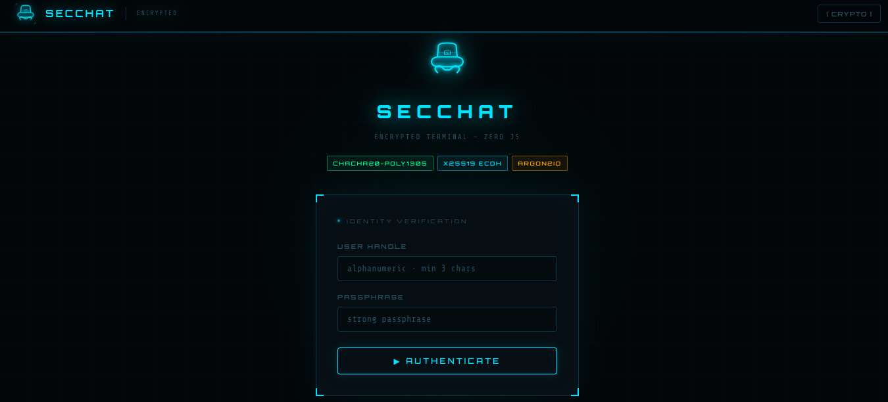
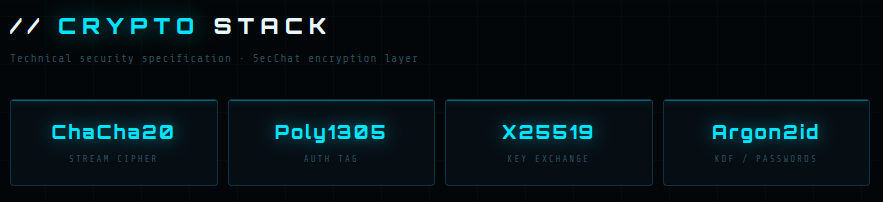
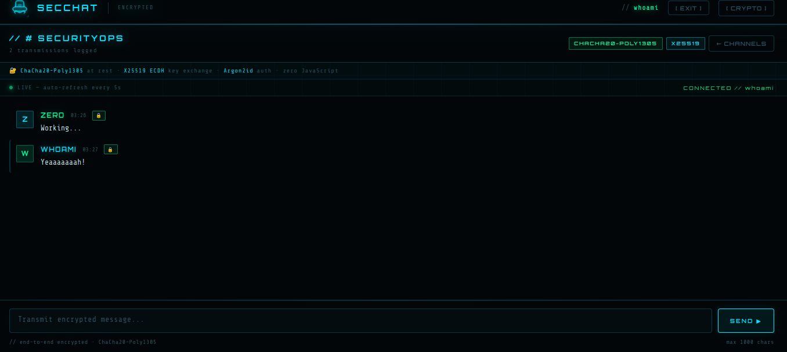

# 🔒 SecChat
Live encrypted chat with **zero JavaScript**.



## Crypto stack

| Layer | Algorithm | Why |
|---|---|---|
| Messages | ChaCha20-Poly1305 | TLS 1.3, Signal, WireGuard — AEAD, timing-attack resistant |
| Key exchange | X25519 ECDH + HKDF-SHA256 | Curve25519, used in Signal Protocol |
| Passwords | Argon2id (64MB, t=3) | PHC winner, GPU/ASIC resistant |
| Sessions | HttpOnly + SameSite=Strict | No JS access, CSRF-safe |
| Live updates | `<meta http-equiv="refresh">` | Zero JS — page polls every 5s |



## Deploy

```bash
# 1. Clone / copy project
# Edit .env — generate secret:
python3 -c "import secrets; print('SERVER_SECRET=' + secrets.token_hex(32))" > .env

# 2. Run
docker compose up -d --build

# App running at: http://yourip:8100
```

## Nginx Proxy Manager (NPM) config

Point your domain to port `8100`.

Add to Advanced:
```nginx
# Security headers
add_header Strict-Transport-Security "max-age=31536000; includeSubDomains; preload" always;
add_header X-Frame-Options "DENY" always;
add_header X-Content-Type-Options "nosniff" always;
add_header Referrer-Policy "no-referrer" always;
add_header Content-Security-Policy "default-src 'self'; script-src 'none'; style-src 'self' 'unsafe-inline' https://fonts.googleapis.com; font-src https://fonts.gstatic.com; img-src 'none'; connect-src 'none';" always;

# Rate limit (protect login endpoint)
limit_req_zone $binary_remote_addr zone=secchat:10m rate=20r/m;
limit_req zone=secchat burst=10 nodelay;
```

## Architecture

```
Browser (pure HTML forms)
    │  POST /chat/{room}/send
    │  GET  /chat/{room}  ← meta refresh every 5s
    ▼
FastAPI (Python 3.11)
    ├── Argon2id: password verify
    ├── X25519 ECDH: room key derivation
    ├── ChaCha20-Poly1305: encrypt/decrypt each message
    └── SSE: /chat/{room}/stream (optional, for JS clients)
```


## Notes

- In-memory storage - restart clears all messages and users.  
  For persistence: add SQLite with `aiosqlite` (swap `rooms` dict for DB calls).
- `secure=True` on session cookie requires HTTPS - set this in `main.py` when behind NPM.
- SSE endpoint `/chat/{room}/stream` is available for future JS-optional progressive enhancement.
